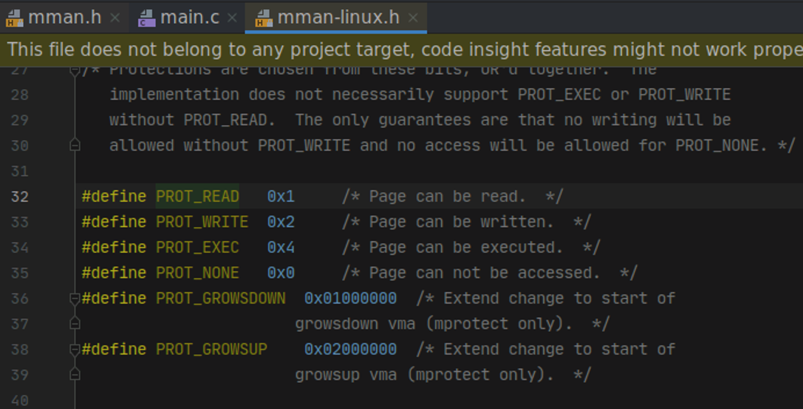
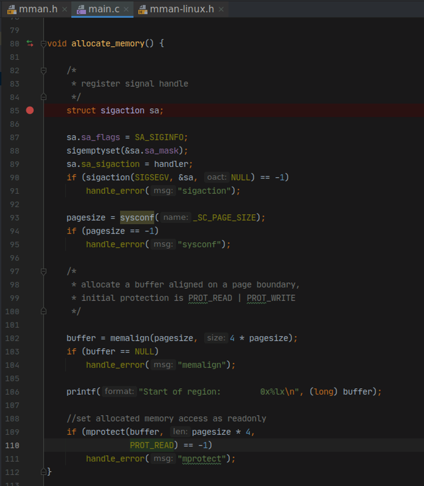
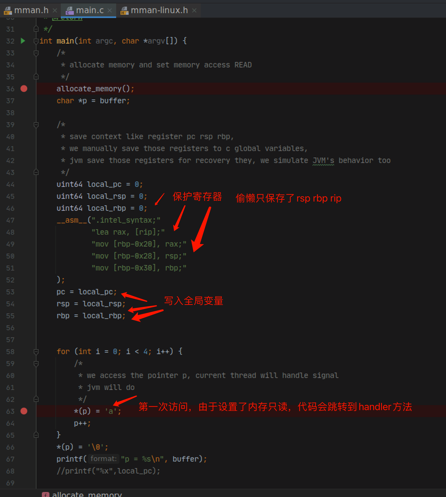
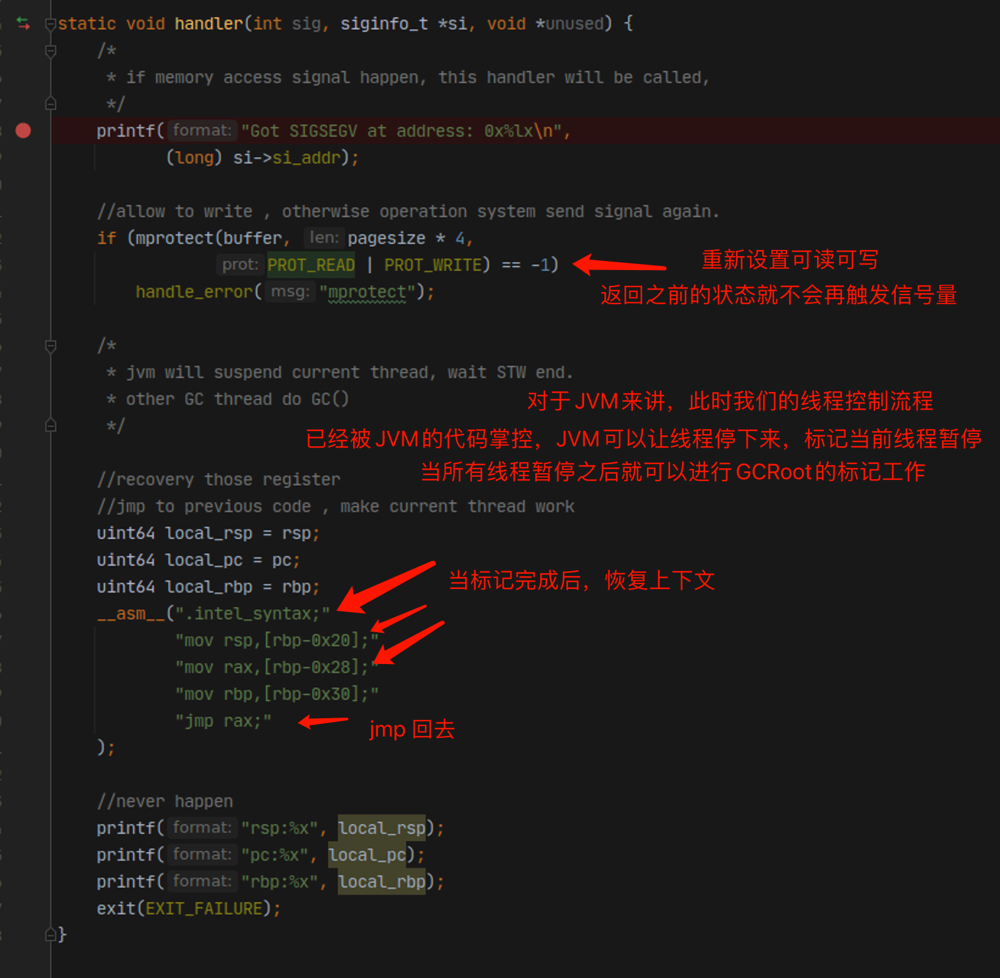

#JVM safe-point 机制

## 通过mprotect设置内存访问权限

* mprotect 提供下图几种访问权限设定 

* 使用mprotect 对特定内存区域设置 只读保护 并注册信号量处理器 
* 当线程访问下图 buffer指针指向的内存，会产生一个信号量，线程会跳转到handler方法
* handler方法暂时按下不表

## main函数流程

* 保存几个寄存器 rsp rbp rip(pc寄存器) 并将其写入全局变量，以便handler恢复上下文
* 第一次访问p指针(也是buffer指针) 由于权限的问题，会跳转到handler方法

## handler流程

* 处理信号量，重新设置buffer指向的区域 为可读可写
* 恢复上下文 jmp到之前 保护现场的汇编代码区域

#技术总结

* mprotect调用 通常可以用来控制线程的运行流程，以便我们做一些额外的工作，且工作线程并不会感知到我们做的工作，例如JVM垃圾回收
* 在汇编层面上要了解 寄存器跟上下文以及各种调用约定，以便我们改变业务线程原本的工作流程后恢复现状
* golang 的协程 其实也是采用类似的手法 来实现的
